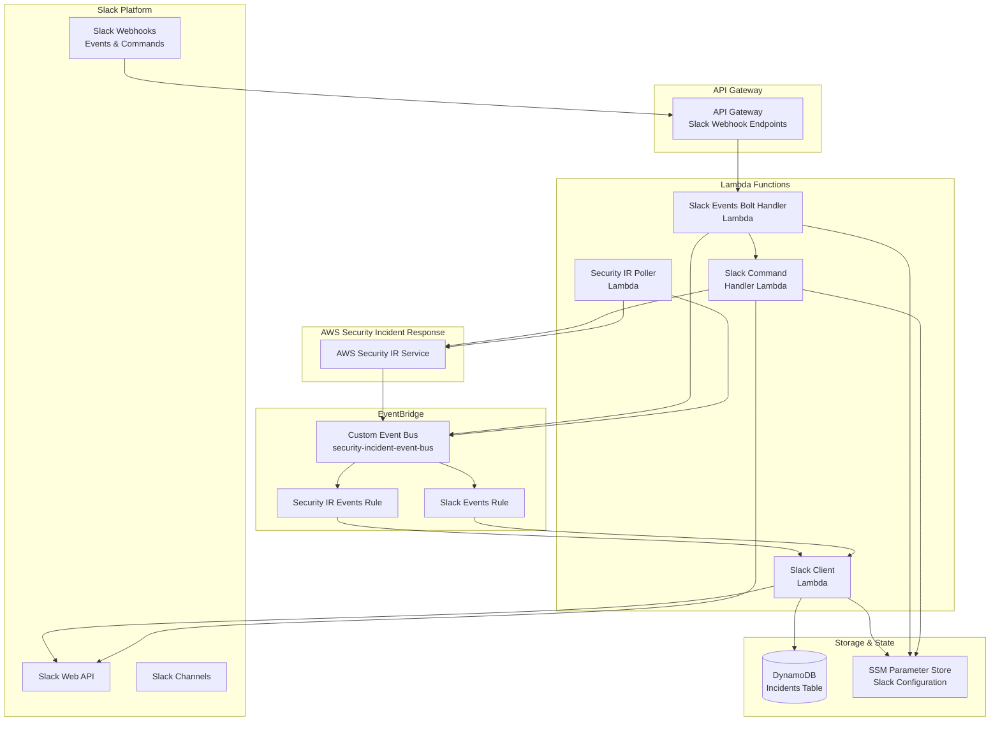

# Design Document

## Overview

The Slack integration for AWS Security Incident Response extends the existing sample integrations architecture to provide bidirectional connectivity between AWS Security Incident Response and Slack. This integration enables real-time notifications, interactive incident management, and seamless collaboration within dedicated Slack channels for each security incident.

The solution follows the same architectural patterns as existing JIRA and ServiceNow integrations, utilizing EventBridge custom event bus, Lambda functions, DynamoDB for state management, and Lambda layers for shared code. The integration creates dedicated Slack channels for each incident, supports slash commands for incident management, and maintains bidirectional synchronization of comments and attachments.

## Architecture

### High-Level Architecture



### Event Flow Patterns

#### 1. AWS SIR to Slack Flow
1. AWS SIR case created/updated → EventBridge custom event bus
2. Slack Client Lambda processes event
3. **For new cases**: Creates Slack channel, stores `slackChannelId` in DynamoDB
4. **For updates**: Queries DynamoDB for `slackChannelId`, posts to specific channel
5. Updates DynamoDB mapping table with latest sync timestamp

#### 2. Slack to AWS SIR Flow
1. User posts message/uses slash command in Slack
2. Slack Webhooks → API Gateway → Lambda Handler (Bolt or Command)
3. Lambda processes event and updates AWS SIR
4. Posts confirmation back to Slack channel via Web API
5. Updates DynamoDB mapping table

#### 3. Bidirectional Synchronization
1. Security IR Poller monitors for external changes
2. Detects changes and publishes events to EventBridge
3. Both Slack Client and SIR Client process events
4. Maintains consistency across platforms

## Components and Interfaces

### 1. Slack Client Lambda Function

**Purpose**: Processes AWS SIR events and synchronizes them to Slack

**Key Responsibilities**:
- Create dedicated Slack channels for new incidents
- Store `slackChannelId` in DynamoDB mapping table
- Add case watchers to Slack channels
- Post incident notifications and updates to specific channels using `slackChannelId`
- Sync comments and attachments from SIR to Slack channels
- Handle error scenarios with retry logic

**Channel Resolution Process**:
1. Receive AWS SIR event with `caseId`
2. Query DynamoDB with PK=`Case#<caseId>`, SK=`latest`
3. Extract `slackChannelId` from DynamoDB record
4. Use `slackChannelId` to post updates to correct Slack channel

**Environment Variables**:
```python
{
    "SLACK_BOT_TOKEN": "/SecurityIncidentResponse/slackBotToken",
    "SLACK_WORKSPACE_ID": "/SecurityIncidentResponse/slackWorkspaceId", 
    "INCIDENTS_TABLE_NAME": "incidents-table-name",
    "EVENT_SOURCE": "security-ir",
    "LOG_LEVEL": "error"
}
```

**Event Pattern**:
```json
{
    "source": ["security-ir"],
    "detail-type": ["Case Created", "Case Updated", "Comment Added", "Attachment Added"]
}
```

**Example Flow**:
```python
# 1. Receive AWS SIR event
case_id = event['detail']['caseId']

# 2. Query DynamoDB for Slack channel mapping
response = dynamodb.get_item(
    Key={'PK': f'Case#{case_id}', 'SK': 'latest'}
)
slack_channel_id = response['Item']['slackChannelId']

# 3. Post update to specific Slack channel
slack_client.chat_postMessage(
    channel=slack_channel_id,
    text=f"Case {case_id} updated: {update_details}"
)
```

### 2. Slack Events Bolt Handler Lambda Function

**Purpose**: Uses Slack Bolt framework to handle all Slack events and route slash commands

**Key Responsibilities**:
- Handle all Slack events using Bolt framework (messages, channel events, file uploads)
- Route slash commands to dedicated Slack Command Handler
- Sync user messages to AWS SIR as case comments
- Handle channel membership changes (member_joined_channel, member_left_channel)
- Process file uploads and attachments
- Filter out bot messages and system notifications
- Publish events to EventBridge for further processing

**Slack Bolt Framework Benefits**:
- **Unified Event Handling**: Single handler for all event types using decorators
- **Built-in Authentication**: Automatic request signature verification
- **Event Routing**: Clean `@app.event()`, `@app.message()` decorators
- **Middleware Support**: Built-in logging and error handling
- **Automatic Acknowledgments**: Handles Slack's 3-second acknowledgment requirement

**Environment Variables**:
```python
{
    "SLACK_BOT_TOKEN": "/SecurityIncidentResponse/slackBotToken",
    "SLACK_SIGNING_SECRET": "/SecurityIncidentResponse/slackSigningSecret",
    "EVENT_BUS_NAME": "security-incident-event-bus",
    "INCIDENTS_TABLE_NAME": "incidents-table-name",
    "EVENT_SOURCE": "slack",
    "LOG_LEVEL": "error"
}
```

**Bolt Handler Examples**:
```python
from slack_bolt import App
from slack_bolt.adapter.aws_lambda import SlackRequestHandler

app = App(
    token=slack_bot_token,
    signing_secret=slack_signing_secret,
    process_before_response=True
)

# Message handler for incident channels
@app.message(re.compile(r"aws-security-incident-response-case-.*"))
def handle_incident_message(message, say, client):
    # Sync message to AWS SIR as case comment

# Channel member joined event
@app.event("member_joined_channel")
def handle_member_joined(event, client):
    # Add system comment to AWS SIR case

# File upload handler
@app.event("file_shared")
def handle_file_upload(event, client):
    # Sync attachment to AWS SIR case

# Slash command router
@app.command("/security-ir")
def handle_security_ir_command(ack, command, client):
    ack()  # Acknowledge immediately
    # Route to dedicated Slack Command Handler Lambda

# Lambda handler
def lambda_handler(event, context):
    slack_handler = SlackRequestHandler(app=app)
    return slack_handler.handle(event, context)
```

### 3. Slack Command Handler Lambda Function

**Purpose**: Processes Slack slash commands for incident management

**Key Responsibilities**:
- Handle `/security-ir` slash commands with all subcommands
- Execute AWS SIR API operations (status, update, close)
- Validate user permissions and command parameters
- Provide immediate responses to users

**Supported Commands**:
- `/security-ir status` - Get current case status and details
- `/security-ir update-status <status>` - Update case status
- `/security-ir update-description <description>` - Update case description  
- `/security-ir update-title <title>` - Update case title
- `/security-ir close` - Close the case
- `/security-ir summarize` - Get case summary

**Environment Variables**:
```python
{
    "SLACK_BOT_TOKEN": "/SecurityIncidentResponse/slackBotToken",
    "SLACK_SIGNING_SECRET": "/SecurityIncidentResponse/slackSigningSecret",
    "INCIDENTS_TABLE_NAME": "incidents-table-name",
    "LOG_LEVEL": "error"
}
```

### 4. API Gateway Integration

**Purpose**: Receive Slack webhooks and route to appropriate Lambda handlers

**API Gateway Endpoints**:
- `POST /slack/events` - Slack Events API webhook → Slack Events Bolt Handler
  - Handles all events including slash commands
  - Routes slash commands internally to Slack Command Handler

**Authentication**: 
- Slack request signature verification handled by Bolt framework
- API Gateway request validation and rate limiting

**Benefits of Single Endpoint Architecture**:
- **Unified Entry Point**: All Slack events through single `/slack/events` endpoint
- **Bolt Framework Routing**: Leverages Bolt's built-in event routing capabilities
- **Immediate Response**: Meets Slack's 3-second response requirement
- **Simpler Configuration**: Only one webhook URL to configure in Slack
- **Cost Effective**: Single API Gateway endpoint
- **Follows Best Practices**: Slack's recommended Events API approach

### 5. DynamoDB Schema Enhancement

**Table**: Incidents Table (existing)

**Enhanced Record Structure**:
```json
{
    "PK": "Case#12345",
    "SK": "latest",
    "slackChannelId": "C1234567890",
    "slackChannelCaseDescription": "Security incident description",
    "slackChannelCaseTitle": "Security incident title", 
    "slackChannelCaseComments": ["comment1", "comment2"],
    "slackChannelUpdateTimestamp": "2025-01-15T10:30:00Z",
    "caseId": "12345",
    "status": "Open",
    "severity": "High",
    "lastSyncTimestamp": "2025-01-15T10:30:00Z"
}
```

**Critical Role of `slackChannelId`**:
- **Bidirectional Sync**: Enables AWS SIR → Slack updates to reach correct channel
- **Channel Resolution**: Maps case IDs to specific Slack channels
- **Update Routing**: Ensures comments/attachments go to right incident channel
- **Error Recovery**: Allows retry operations to target correct channel

### 6. Lambda Layers (Shared)

**Domain Layer**: Enhanced with Slack-specific models
**Mappers Layer**: New Slack mappers for data transformation  
**Wrappers Layer**: Slack Bolt framework wrapper with AWS integrations

**Slack Bolt Layer**: New dedicated layer containing:
- `slack-bolt` Python package
- `slack-sdk` Python package  
- Socket Mode adapter
- Custom AWS integrations (EventBridge, DynamoDB)

## Data Models

### Slack Channel Model
```python
class SlackChannel:
    def __init__(self, channel_id, channel_name, case_id, members=None):
        self.channel_id = channel_id
        self.channel_name = channel_name  
        self.case_id = case_id
        self.members = members or []
        self.created_at = datetime.utcnow()
```

### Slack Message Model
```python
class SlackMessage:
    def __init__(self, message_id, channel_id, user_id, text, timestamp, thread_ts=None):
        self.message_id = message_id
        self.channel_id = channel_id
        self.user_id = user_id
        self.text = text
        self.timestamp = timestamp
        self.thread_ts = thread_ts
```

### Slack Attachment Model
```python
class SlackAttachment:
    def __init__(self, file_id, filename, url, size, mimetype):
        self.file_id = file_id
        self.filename = filename
        self.url = url
        self.size = size
        self.mimetype = mimetype
```

## Error Handling

### Retry Strategy
- **Exponential Backoff**: Initial delay 1s, max delay 60s, max 5 retries
- **Dead Letter Queues**: For failed events requiring manual intervention
- **Circuit Breaker**: Temporary disable integration if Slack API is consistently failing

### Error Reporting
- **System Comments**: Add comments to AWS SIR cases with `[Slack Update]` tag for failed operations
- **CloudWatch Alarms**: Monitor error rates and response times
- **Detailed Logging**: Comprehensive error context without sensitive data

### Failure Scenarios
1. **Slack Channel Creation Failure**: Retry with backoff, add system comment if all retries fail
2. **Message Sync Failure**: Queue for retry, log error details
3. **Attachment Upload Failure**: Add system comment with failure reason
4. **API Rate Limiting**: Implement exponential backoff with jitter
5. **Authentication Failure**: Alert administrators, disable integration temporarily

## Testing Strategy

### Unit Tests
- **Lambda Function Logic**: Test event processing, API calls, error handling
- **Data Mappers**: Test transformation between AWS SIR and Slack formats
- **API Wrappers**: Mock Slack API responses, test error scenarios

### Integration Tests
- **End-to-End Flows**: Test complete incident lifecycle from creation to closure
- **Bidirectional Sync**: Verify changes propagate correctly in both directions
- **Error Recovery**: Test retry mechanisms and failure handling

### Load Testing
- **Concurrent Incidents**: Test handling multiple incidents simultaneously
- **High Message Volume**: Test message synchronization under load
- **API Rate Limits**: Verify graceful handling of Slack API limits

### Security Testing
- **Authentication**: Verify Slack signature validation
- **Authorization**: Test user permission validation
- **Data Sanitization**: Ensure no sensitive data in logs
- **Input Validation**: Test malformed Slack payloads

## Configuration Management

### SSM Parameters
```
/SecurityIncidentResponse/slackBotToken - Slack Bot User OAuth Token (xoxb-...)
/SecurityIncidentResponse/slackSigningSecret - Slack App Signing Secret for webhook verification
/SecurityIncidentResponse/slackWorkspaceId - Target Slack Workspace ID
/SecurityIncidentResponse/slackChannelPrefix - Channel naming prefix (default: aws-security-incident-response-case-)
```

### Environment-Specific Settings
- **Development**: Separate Slack workspace for testing
- **Staging**: Limited user access, test data
- **Production**: Full integration with monitoring and alerting

## Security Considerations

### Authentication & Authorization
- **Slack Bot Token**: Stored in SSM Parameter Store with encryption (xoxb-...)
- **Slack Signing Secret**: Stored in SSM Parameter Store for webhook verification
- **Request Verification**: Validate Slack request signatures using signing secret
- **User Permissions**: Verify user access to security incident data within Slack workspace

### Data Protection
- **Encryption**: All data encrypted in transit and at rest
- **PII Handling**: No personally identifiable information in logs
- **Access Control**: Least privilege IAM roles for all components
- **Audit Trail**: Complete logging of all user actions

### Network Security
- **VPC Integration**: Lambda functions in private subnets (optional)
- **API Gateway Security**: Rate limiting, throttling, and request validation
- **Slack IP Allowlisting**: Restrict API Gateway to known Slack IP ranges
- **Token Rotation**: Regular rotation of Slack tokens

## Monitoring and Observability

### CloudWatch Metrics
- **Message Processing Rate**: Messages/minute processed
- **Error Rate**: Percentage of failed operations
- **API Response Times**: Latency for Slack API calls
- **Channel Creation Success**: Success rate for new channels

### CloudWatch Alarms
- **High Error Rate**: Alert when error rate exceeds 5%
- **API Latency**: Alert when response times exceed 5 seconds
- **Failed Channel Creation**: Alert on channel creation failures
- **Authentication Failures**: Alert on repeated auth failures

### Logging Strategy
- **Structured Logging**: JSON format for easy parsing
- **Correlation IDs**: Track requests across components
- **Error Context**: Detailed error information for troubleshooting
- **Performance Metrics**: Execution times and resource usage

### Dashboards
- **Operational Dashboard**: Real-time metrics and health status
- **Business Dashboard**: Incident volume and response times
- **Error Dashboard**: Error trends and failure analysis

## Deployment Strategy

### Infrastructure as Code
- **CDK Stack**: `AwsSecurityIncidentResponseSlackIntegrationStack`
- **Parameter Management**: Automated SSM parameter creation
- **IAM Roles**: Least privilege access for all components

### Deployment Pipeline
1. **Build**: Package Lambda functions and layers
2. **Test**: Run unit and integration tests
3. **Deploy**: CDK deployment with rollback capability
4. **Verify**: Health checks and smoke tests
5. **Monitor**: Automated monitoring setup

### Rollback Strategy
- **Blue/Green Deployment**: Zero-downtime deployments
- **Feature Flags**: Gradual rollout of new features
- **Circuit Breaker**: Automatic fallback on failures
- **Manual Override**: Emergency disable capability

## Slack Bolt Implementation Details

### Bolt Framework Integration
- **Socket Mode**: Eliminates need for HTTP endpoints and webhook management
- **Event Handlers**: Declarative pattern for handling different Slack events
- **Middleware**: Built-in authentication, logging, and error handling
- **AWS Adapter**: Custom adapter to integrate Bolt with EventBridge and DynamoDB

### Key Bolt Components
```python
from slack_bolt import App
from slack_bolt.adapter.socket_mode import SocketModeHandler

# Initialize Bolt app
app = App(token=slack_bot_token)

# Slash command handler
@app.command("/security-ir")
def handle_security_ir_command(ack, command, client, logger):
    ack()
    # Command processing logic

# Message handler for incident channels  
@app.message(re.compile(r"aws-security-incident-response-case-.*"))
def handle_incident_message(message, say, client):
    # Sync message to AWS SIR

# Socket Mode handler
handler = SocketModeHandler(app, slack_app_token)
handler.start()
```

### Bolt Advantages for This Integration
- **Simplified Event Handling**: No manual webhook parsing or acknowledgment logic
- **Built-in Retry Logic**: Automatic retries for failed Slack API calls
- **Type Safety**: Better error handling and debugging
- **Community Support**: Well-maintained framework with extensive documentation
- **AWS Lambda Compatibility**: Works well with Lambda runtime environment

## Performance Optimization

### Lambda Optimization
- **Memory Allocation**: Right-sized based on workload (recommend 512MB for Bolt apps)
- **Connection Pooling**: Bolt handles WebSocket connection management
- **Async Processing**: Bolt supports async/await patterns
- **Cold Start Mitigation**: Provisioned concurrency for Socket Mode handler

### DynamoDB Optimization
- **Single Table Design**: Efficient data access patterns
- **Composite Keys**: Optimized query performance
- **TTL**: Automatic cleanup of old records
- **Backup Strategy**: Point-in-time recovery enabled

### Slack API Optimization
- **Rate Limit Handling**: Respect Slack API limits
- **Batch Operations**: Group API calls where possible
- **Caching**: Cache frequently accessed data
- **Compression**: Minimize payload sizes