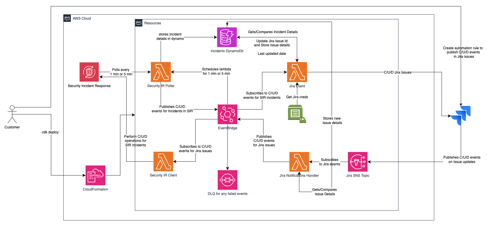
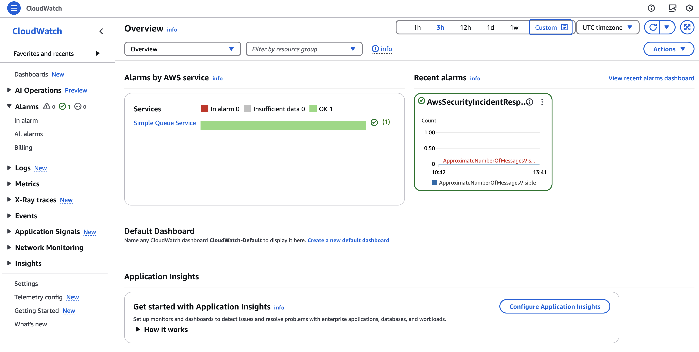

# AWS Security Incident Response Sample Integrations

This project provides sample integrations for AWS Security Incident Response, enabling customers to seamlessly integrate the service with their existing applications for incident response, stakeholder notifications, and case management.

## Overview

AWS Security Incident Response helps customers respond when it matters the most. This project aims to address the gap between the service's public APIs/SDKs and direct connections to common applications like Slack, JIRA, and ServiceNow. It enables customers to execute API actions directly from their preferred applications while preserving AWS Security Incident Response core capabilities.

This repository contains:

- **Jira Integration**: Bidirectional integration between AWS Security Incident Response and Jira for issue tracking
- **ServiceNow Integration**: Bidirectional integration between AWS Security Incident Response and ServiceNow for incident management
- **Common Infrastructure**: Shared components like EventBridge event bus, DynamoDB tables, and Lambda layers
- **Deployment Scripts**: Easy-to-use deployment tools for quick setup

## Getting Started

### Prerequisites

- **AWS Account** with permissions to create the required resources
- **For Jira integration**
  - Jira Cloud account
- **For ServiceNow integration**
  - ServiceNow instance with admin access

### Installation

**Note: Please skip this section if you are using `CloudShell` as your development workspace**

Install the following applications in your local development workstations or EC2 instances (if not installed already):

- **AWS CDK v2.x**: Follow the installation steps in the [CDK documentation](https://docs.aws.amazon.com/cdk/v2/guide/getting-started.html).
- **Python v3.9+**: Download and follow the instructions in the [Python documentation](https://www.python.org/downloads/).
- **AWS CLI**: Configured with appropriate permissions. To install, follow the setup instructions in the [AWS CLI documentation](https://docs.aws.amazon.com/cli/latest/userguide/getting-started-install.html).
- **NVM**: Use the install and update script command `curl -o- https://raw.githubusercontent.com/nvm-sh/nvm/v0.40.3/install.sh | bash` followed by `source ~/.bashrc`. For more details, see the Node Version Manager's README in [NVM's GitHub repo](https://github.com/nvm-sh/nvm?tab=readme-ov-file#installing-and-updating).
- **Node**: Run `nvm install --lts` and `nvm use --lts` to install and use the latest Long Term Support (LTS) version of Node.js.
- **PIP**: Should already be included with Python installation (for versions Python 3.4 and above). For more details, see [pip documentation](https://pip.pypa.io/en/stable/installation/)
- **Docker**: Use `sudo yum install -y docker` to install the Docker engine on linux based systems. For a complete guide on how to install/setup Docker engine on different OSs, see [Docker Engine documentation](https://docs.docker.com/engine/install/).
  - In order to synthesize and deploy the integration solution, docker should be running. You can start docker by running the following commands:
    - `sudo systemctl start docker.service`
    - `docker ps`
    - `chmod a+wr /var/run/docker.sock`
  - Alternatively if you want to use Docker Desktop, follow the guidance in Docker docs for [Getting Docker](https://docs.docker.com/get-started/get-docker/)
  
### Setup Solution Repository

1. Clone the repository: `git clone https://github.com/aws-samples/sample-aws-security-incident-response-integrations.git`
   1. If you had already cloned the repository before, make sure to pull the latest changes: `git pull`
2. Install solution dependencies

   ```
   pip install -r requirements.txt
   ```

3. (Optional - for development purposes) Install development dependencies:

   ```
   pip install -r requirements-dev.txt
   ```

### Deployment

For deployment of an integration pattern, install and use the `deploy-integrations-solution` supplementary python app
in the command-line using the following steps:

1. Add the `deploy-integrations-solution.py` script to the `bin` path using the following commands:

   ```
   sudo cp deploy-integrations-solution.py /usr/local/bin/deploy-integrations-solution
   ```

   ```
   sudo chmod +x /usr/local/bin/deploy-integrations-solution
   ```

2. Verify if the `deploy-integrations-solution` works in the command-line by running:

   ```
   deploy-integrations-solution --help
   ```

   You should see the following output:

   ```
   usage: deploy-integrations-solution [-h] [--log-level {info,debug,error}] {jira,service-now} ...

   Deploy AWS Security Incident Response Sample Integrations

   positional arguments:
   {jira,service-now}    Integration type
      jira                Deploy Jira integration
      service-now         Deploy ServiceNow integration

   options:
   -h, --help            show this help message and exit

3. Alternatively, if you are not able to add the `deploy-integrations-solution.py` script to the `bin` path, you can use the script directly by replacing `deploy-integrations-solution` in the above examples with `./deploy-integrations-solution.py` command.

4. See [JIRA documentation](documentation/JIRA/JIRA.md) for detailed instructions on how to deploy JIRA integration.
5. See [ServiceNow documentation](documentation/SERVICE_NOW/SERVICE_NOW.md) for detailed instructions on how to deploy ServiceNow integration.

## Features

- **Bidirectional Connectivity**: Seamless two-way synchronization between AWS Security Incident Response and target applications
- **Real-time Updates**: Event-driven architecture ensures near-instantaneous updates across systems
- **Comprehensive Jira Integration**:
  - Create, update, and delete issues in Jira based on AWS Security Incident Response cases
  - Sync comments, attachments, and status changes
  - [Detailed Jira integration documentation](documentation/JIRA/JIRA.md)
- **Full-featured ServiceNow Integration**:
  - Create, update, and delete incidents in ServiceNow based on AWS Security Incident Response cases
  - Automatic setup of ServiceNow components (Business Rules, REST Messages)
  - [Detailed ServiceNow integration documentation](documentation/SERVICE_NOW/SERVICE_NOW.md)
- **Robust Error Handling**: Dead-letter queues, CloudWatch alarms, and comprehensive logging
- **Secure by Design**: Least privilege permissions, secure credential storage, and encryption
- **Extensible Framework**: Modular architecture makes it easy to add new integrations

## Architecture



### Core AWS Services

The solution leverages the following AWS services:

- **Amazon EventBridge**: Custom event bus named "security-incident-event-bus" for routing events between systems
- **AWS Lambda**: Serverless compute for processing events and API calls, including a Security IR Poller that runs every minute
- **Amazon Simple Notification Service (SNS)**: Messaging service for receiving events from Jira
- **Amazon API Gateway**: Webhook endpoint for receiving events from ServiceNow
- **Amazon Simple Queue Service (SQS)**: Dead-letter queue for handling failed events
- **Amazon DynamoDB**: NoSQL database table with partition key "PK" and sort key "SK" for storing mapping information
- **Amazon CloudWatch**: Monitoring, logging (with one-week retention), and alerting
- **AWS Systems Manager Parameter Store**: Secure storage for credentials and configuration
- **AWS Lambda Layers**: Shared code layers for domain models, mappers, and wrappers
- **AWS Security Incident Response (SIR)**: Core security incident response service

## Usage

### Jira Integration

To use the Jira integration:

1. Deploy the integration using the instructions in the [Jira Integration Documentation](documentation/JIRA/JIRA.md)
2. Configure Jira Automation to send events to the SNS topic
3. Test the integration by creating a security incident in AWS Security Incident Response
4. Verify that an issue is created in your Jira project

For detailed instructions on setting up the Jira integration, including automation rules, API token creation, and troubleshooting tips, refer to the [Jira Integration Documentation](documentation/JIRA/JIRA.md).

### ServiceNow Integration

To use the ServiceNow integration:

1. Deploy the integration using the instructions in the [ServiceNow Integration Documentation](documentation/SERVICE_NOW/SERVICE_NOW.md)
2. The ServiceNow Resource Setup Lambda will automatically configure the necessary components in ServiceNow
3. Test the integration by creating a security incident in ServiceNow
4. Verify that a case is created in AWS Security Incident Response

For detailed instructions on setting up the ServiceNow integration, including business rules, outbound REST messages, and troubleshooting tips, refer to the [ServiceNow Integration Documentation](documentation/SERVICE_NOW/SERVICE_NOW.md).

## Troubleshooting

### Common Issues

#### Failed Event Delivery

**What happens if updates from AWS Security Incident Response or Jira/ServiceNow fail?**

The integration includes robust error handling mechanisms:

1. **Dead-Letter Queue (DLQ)**: Events that fail to be delivered to EventBridge are sent to a DLQ
2. **CloudWatch Alarms**: Alarms trigger when messages appear in the DLQ
3. **CloudWatch Dashboard**: Provides visibility into the integration's health



**Where is the DLQ?**

The DLQ is a standard Amazon SQS queue that EventBridge uses to store events that couldn't be delivered to a target. Look for an SQS queue with a name similar to `AwsSecurityIncidentResponseSample-SecurityIncidentEventBusLoggerdead-*` and check for messages.

#### Processing Failed Events

To process failed events in the DLQ:

1. Navigate to the SQS console and find the DLQ
2. Select the messages and choose "View/Delete Messages"
3. Examine the message content to understand the failure
4. Manually process the events or use the AWS SDK to programmatically process them

### Integration-Specific Troubleshooting

- For Jira integration issues, see the [Jira Integration Troubleshooting Guide](documentation/JIRA/JIRA.md#troubleshooting)
- For ServiceNow integration issues, see the [ServiceNow Integration Troubleshooting Guide](documentation/SERVICE_NOW/SERVICE_NOW_TROUBLESHOOTING.md)

### Getting Help

If you encounter issues that aren't covered in the troubleshooting guides:

1. Check the CloudWatch Logs for the relevant Lambda functions
2. Review the EventBridge event bus for event delivery status
3. Open an issue in the GitHub repository with detailed information about the problem

## Development

To contribute to this project, please review the [CONTRIBUTING.md](CONTRIBUTING.md) file (not included in the provided files, but recommended to create).

### Testing

Run tests using pytest:

```
pytest
```

### Code Quality

This project uses [ruff](https://github.com/astral-sh/ruff) to enforce code quality standards. To set up ruff:

1. Install development dependencies:

```
pip install -r requirements-dev.txt
```

2. Format code

```
ruff format
```

## Security

This project implements various security measures to protect your data and infrastructure:

### Access Controls

- **Least Privilege Principle**: IAM roles with minimal permissions required for each function
- **Resource-Based Policies**: SNS topics and other resources have strict access policies
- **CDK Nag Suppressions**: Any security findings are explicitly documented and suppressed only when necessary

### Credential Management

- **AWS Systems Manager Parameter Store**: All credentials are stored securely in Parameter Store
- **No Hardcoded Secrets**: All sensitive values are passed as parameters during deployment
- **Secure String Parameters**: Sensitive values are stored as encrypted SecureString parameters

### Monitoring and Logging

- **CloudWatch Logs**: Comprehensive logging for all Lambda functions
- **CloudWatch Alarms**: Alerts for failed events and other issues
- **CloudWatch Dashboard**: Visibility into the integration's health and performance

### Data Protection

- **Data Encryption**: DynamoDB tables use encryption at rest
- **Secure Communication**: All API calls use HTTPS
- **Minimal Data Storage**: Only essential mapping information is stored

### Best Practices

- Regularly rotate API tokens and credentials
- Monitor CloudWatch Logs for suspicious activity
- Keep the integration components updated to the latest versions

## License

This project is licensed under the MIT-0 License. See the LICENSE file for details.

## Contributing

We welcome contributions! Please see the [CONTRIBUTING.md](CONTRIBUTING.md) file for details on how to contribute to this project.

## Frequently Asked Questions

### General Questions

**Q: Can I use both Jira and ServiceNow integrations simultaneously?**  
A: Yes, you can deploy both integrations to connect AWS Security Incident Response with both Jira and ServiceNow.

**Q: How much does it cost to run these integrations?**  
A: The cost depends on your usage of AWS services like Lambda, EventBridge, SNS, and DynamoDB. Most deployments will fall within the AWS Free Tier for these services with moderate usage.

**Q: Can I customize the integrations for my specific needs?**  
A: Yes, the integrations are designed to be extensible. You can modify the Lambda functions, event patterns, and other components to meet your specific requirements.

**Q: How secure are these integrations?**  
A: The integrations follow AWS security best practices, including least privilege access, secure credential storage, and encryption. See the [Security](#security) section for more details.

### Technical Questions

**Q: What happens if an integration component fails?**  
A: The integrations include error handling mechanisms like dead-letter queues and CloudWatch alarms. Failed events are stored for later processing.

**Q: Can I deploy these integrations in multiple AWS regions?**  
A: Yes, you can deploy the integrations in any AWS region where the required services are available.

**Q: How do I update an integration after deployment?**  
A: You can update an integration by running the deployment command again with the same or updated parameters.

**Q: Where can I find detailed logs for troubleshooting?**  
A: All Lambda functions write logs to CloudWatch Logs. You can find the log groups in the CloudWatch console or use the URLs provided in the CloudFormation outputs.

## Support

For support, please open an issue in the GitHub repository or contact AWS support.
