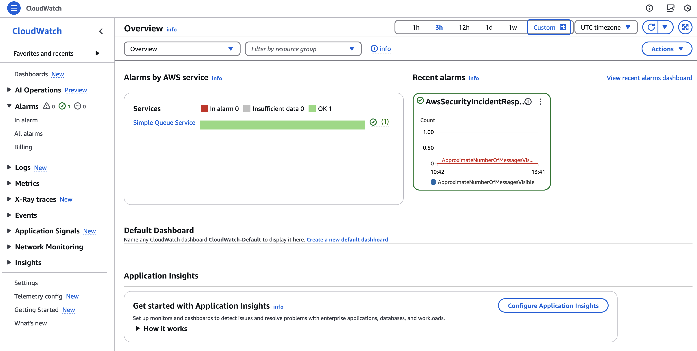

# AWS Security Incident Response Sample Integrations

This project provides sample integrations for AWS Security Incident Response, enabling customers to seamlessly integrate the service with their existing applications for incident response, stakeholder notifications, and case management.

## Overview

AWS Security Incident Response helps customers respond when it matters the most. This project aims to address the gap between the service's public APIs/SDKs and direct connections to common applications like Slack, JIRA, and ServiceNow. It enables customers to execute API actions directly from their preferred applications while preserving AWS Security Incident Response core capabilities.

## Features

- Bidirectional connectivity between AWS Security Incident Response and target applications
- Preservation of core Security Incident Response capabilities
- Integration with JIRA for incident tracking
- Integration with Slack for real-time notifications and interactions
- Extensible framework for adding new integrations

## Architecture


The solution uses the following AWS services:
- Amazon EventBridge
- AWS Lambda
- Amazon Simple Notification Service
- Amazon Simple Queue Service
- Amazon DynamoDB
- Amazon CloudWatch
- AWS Security Incident Response (SIR)

There are 2 potential flows in the integration between Jira and SIR.

Let's walk through the first flow, initiated from SIR.

A **Security IR Poller Lambda** periodically polls for incidents generated by SIR, stores the incident details in DynamoDB and publishes Create, Update or Delete SIR incidents events to EventBridge. A **Jira Client Lambda** subscribed the the SIR incidents EventBridge events, gets or compares the incident details, updates the Jira issue ID, and perform the appropriate action in Jira (Create, Update, or Delete Jira issues).

Now, let's walk through the second flow, initiated from Jira.

Jira publishes Create, Update or Delete events of Issues to the **Jira SNS Topic**. A **Jira Notification Handler Lambda** subscribes to the SNS Topic and publishes the events to EventBridge. A **Security IR Client Lambda** subscribes to the Jira issues events and perform the appropriate operation (Create, Update, or Delete) on SIR.

To avoid losing events after they fail to be delivered to EventBridge, we have configured a dead-letter queue (DLQ) and send all failed events to it for processing later. See the Troubleshooting section for more information.

## Getting Started

### Prerequisites

- AWS CDK
- Python 3.x
- AWS CLI configured with appropriate permissions

### Installation

1. Clone the repository
2. Install dependencies
   ```
   pip install -r requirements.txt
   ```
3. Install development dependencies (optional):
   ```
   pip install -r requirements-dev.txt
   ```

### Deployment

For deployment of an integration pattern, install and use the `deploy-integrations-solution` supplementary python app
in the command-line using the following steps:

1. Add the `deploy-integrations-solution.py` script to the `bin` path:
   ```
   sudo cp deploy-integrations-solution.py /usr/local/bin/deploy-integrations-solution\nsudo chmod +x /usr/local/bin/deploy-integrations-solution\n
   ```
2. Verify if the `deploy-integrations-solution` works in the command-line by running:
   ```
   deploy-integrations-solution --help
   ```
   You should see the following output:
   ```
   usage: deploy-integrations-solution [-h] [--log-level {info,debug,error}] {jira,service-now} ...

   Deploy AWS Security Incident Response Sample Integrations

   positional arguments:
   {jira,service-now}    Integration type
      jira                Deploy Jira integration
      service-now         Deploy ServiceNow integration

   options:
   -h, --help            show this help message and exit
   --log-level {info,debug,error}
                           Log level for Lambda functions
   ```
3. Use the `jira` argument to deploy the JIRA integration:
   `deploy-integrations-solution jira -h`
   You should see the following output:
   ```
   usage: deploy-integrations-solution jira [-h] --email EMAIL --url URL --token TOKEN

   options:
      -h, --help     show this help message and exit
      --email EMAIL  Jira email
      --url URL      Jira URL
      --token TOKEN  Jira API token
   ```
   Provide the respective parameters for each of the above arguments to perform a deploy:
   `deploy-integrations-solution jira --email <email> --url <url> --token <token>`
4. Use the `--log-level` to set the value as `info`, `debug`, `error`. The default log-level is set to `error`
5. Alternatively, if you are not able to add the `deploy-integrations-solution.py` script to the `bin` path, you can
   use the script directly by replacing `deploy-integrations-solution` in the above examples with
   `./deploy-integrations-solution.py` command.

**Note: Service Now integration is under development. If you use the `service-now` argument in the deploy command, you**
**will receive the following message:**
```
Service Now integration is under development/maintenance...Please wait for its release
```

## Usage

[Provide specific instructions on how to use the integrations, including any configuration steps]

## Troubleshooting

**What Happen if Updates from AWS Security Incident Response or JIRA Fail?**

In that scenario, it's possible that events failed to be delivered to EventBridge. We have configured a dead-letter queue (DLQ), CloudWatch Alarm, and CloudWatch Dashboard. The alarm checks every minute and it triggers immediately when messages appear in the DLQ. If the alarm gets triggered, be sure to process failed events in the DLQ to avoid losing any events. You can view the Alarm and Dashboard in CloudWatch.



**Where is the DLQ?**
The DLQ in this integration is a standard Amazon SQS queues that EventBridge uses to store events that couldn't successfully be delivered to a target. Look for an SQL queue with a name similar to `AwsSecurityIncidentResponseSample-SecurityIncidentEventBusLoggerdead-*` and check for messages.

## Development

To contribute to this project, please review the [CONTRIBUTING.md](CONTRIBUTING.md) file (not included in the provided files, but recommended to create).

### Testing

Run tests using pytest:

```
pytest
```

### Code Quality

This project uses [ruff](https://github.com/astral-sh/ruff) to enforce code quality standards. To set up ruff:

1. Install development dependencies:
```
pip install -r requirements-dev.txt
```

2. Format code
```
ruff format
```

## Security

This project implements various security measures, including:
- Least privilege access controls
- Secure handling of credentials and sensitive data
- Logging and monitoring for security events

For more details, refer to the project's security documentation.

## License

This project is licensed under the MIT-0 License. See the LICENSE file for details.

## Contributing

We welcome contributions! Please see the [CONTRIBUTING.md](CONTRIBUTING.md) file for details on how to contribute to this project.

## Support

For support, please open an issue in the GitHub repository or contact AWS support.


## Development

To contribute to this project, please review the [CONTRIBUTING.md](CONTRIBUTING.md) file (not included in the provided files, but recommended to create).

### Testing

Run tests using pytest:

```
pytest
```

### Code Quality

This project uses [ruff](https://github.com/astral-sh/ruff) to enforce code quality standards. To set up ruff:

1. Install development dependencies:
```
pip install -r requirements-dev.txt
```

2. Format code
```
ruff format
```

## Security

This project implements various security measures, including:
- Least privilege access controls
- Secure handling of credentials and sensitive data
- Logging and monitoring for security events

For more details, refer to the project's security documentation.

## License

This project is licensed under the MIT-0 License. See the LICENSE file for details.

## Contributing

We welcome contributions! Please see the [CONTRIBUTING.md](CONTRIBUTING.md) file for details on how to contribute to this project.

## Support

For support, please open an issue in the GitHub repository or contact AWS support.