# AWS Security Incident Response Jira Integration

This document provides an overview of the AWS Security Incident Response Jira integration, including its architecture, resources, parameters, and outputs.

## Deployment

1. Use the `jira` argument to deploy the JIRA integration:
   `./deploy-integrations-solution.py jira -h`
   You should see the following output:

   ```
   usage: deploy-integrations-solution jira [-h] --email EMAIL --url URL --token TOKEN

   options:
      -h, --help     show this help message and exit
      --email EMAIL  Jira email
      --url URL      Jira URL
      --token TOKEN  Jira API token
      --project-key  Jira Project key
      --log-level    info,debug,error: Log level for Lambda functions
2. Deploy the integration with a single command

   ```bash
   ./deploy-integrations-solution.py jira \
      --email <your-jira-email> \
      --url <your-jira-url> \
      --token <your-jira-api-token> \
      --project-key <your-jira-project-key> \
      --log-level {info, debug, error}

The Jira integration stack requires the following parameters during deployment:

| Parameter | Description | Type | Required | Example |
|-----------|-------------|------|----------|---------|
| `jiraEmail` | The email address associated with your Jira account | String | Yes | `user@example.com` |
| `jiraUrl` | The URL of your Jira instance | String | Yes | `https://your-company.atlassian.net` |
| `jiraToken` | The API token for Jira API access | String | Yes | `********` |
| `jiraProjectKey` | The key of the Jira project where issues will be created | String | Yes | `SEC` |
| `logLevel` | The log level for Lambda functions | String | No | `info`, `debug`, or `error` (default) |

See the section below for instructions on how to obtain your Jira email, URL, and API token.

### Getting Your Jira Email

1. Log in to your Atlassian account
2. Click on your profile picture in the top-right corner
3. Select "Account settings"
4. Your email address is displayed in the profile section
5. Use this email address for the `--email` parameter

### Finding Your Jira URL

1. Log in to your Jira instance
2. The URL in your browser's address bar is your Jira URL
3. For Jira Cloud, it typically looks like `https://your-company.atlassian.net`
4. Use this URL for the `--url` parameter

### Creating a Jira API Token

1. Log in to your Atlassian account at https://id.atlassian.com/manage-profile/security/api-tokens
2. Click "Create API token"
3. Enter a label for your token (e.g., "AWS Security IR Integration")
4. Click "Create"
5. Copy the generated token (you won't be able to see it again)
6. Use this token for the `--token` parameter

### Identifying Your Jira Project Key

1. Log in to your Jira instance
2. Navigate to the project you want to use for security incidents
3. The project key is typically displayed in the URL and in the project header
4. For example, in the URL `https://your-company.atlassian.net/browse/SEC-123`, the project key is `SEC`
5. Use this project key for the `--project-key` parameter

### Set Up Your Jira Project (only if you do not have a project already)

1. Create a dedicated project for security incidents if you don't have one
2. Note the project key (e.g., "SEC" or "SECURITY")
3. Ensure you have appropriate permissions in this project

## Post Deployment

Once the deployment of the JIRA integration is complete, you will need to configure JIRA automation rules to provision JIRA to AWS Security Incident Response flow. 

### Configure Jira Automation (Required)

You can configure Automation Rules in JIRA via Project settings. In your Jira project, go to Project settings > Automation. You can do so by clicking on three dots next to your project on the left pane in Jira, and selecting Project settings from the drop-down. See the screenshot below:
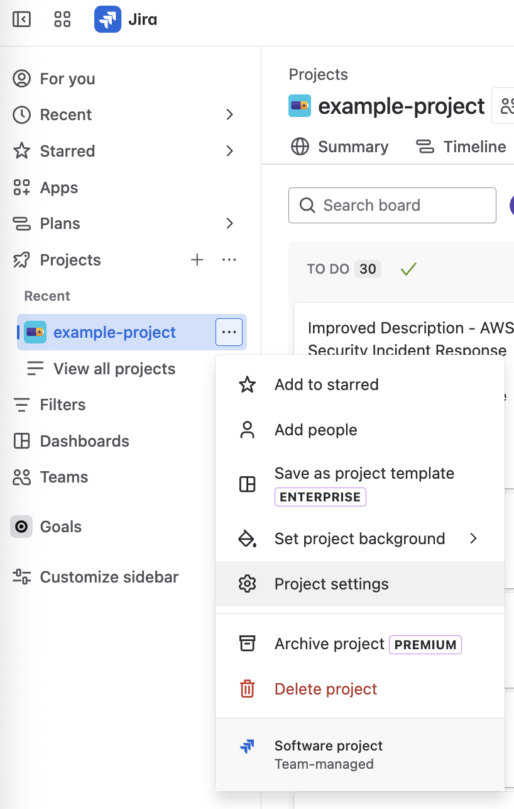  

#### Configure Automation Rule for Field Value Changed trigger (Required)

Follow the steps below to create a rule to trigger events to AWS when an issue is created, updated, or deleted OR an issue field is changed, using the AWS SNS topic arn:

   1. In the `Automation` page, click on `Create Rule` > `Create from scatch` button.
   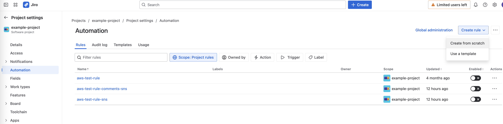
   2. For `When: Add a trigger`, select `Field value changed` from `Add a trigger` pane on the right hand side.
   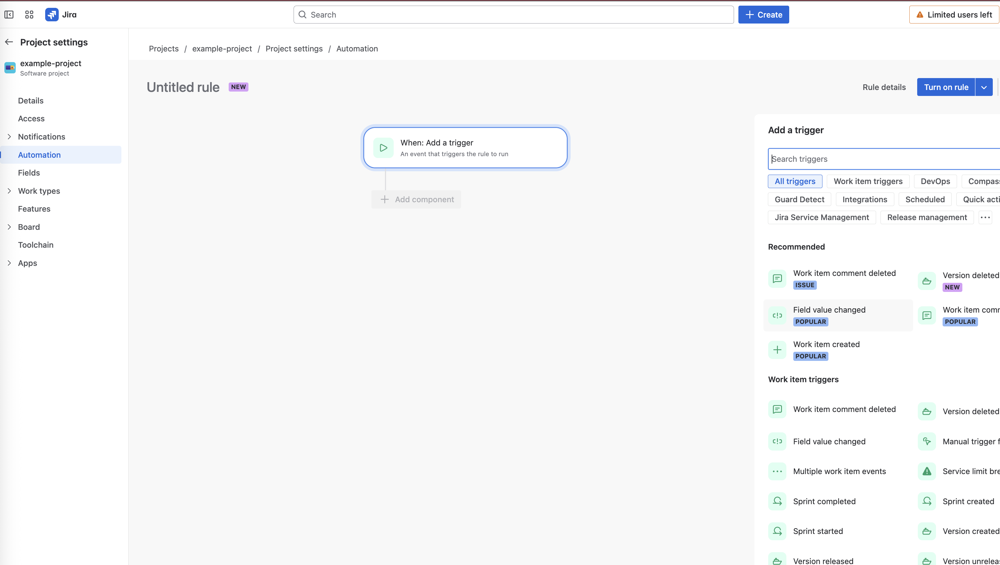
   3. Now, in `Field value changed` pane on the right, select all the fields from the dropdown `Fields to monitor for changes`.
   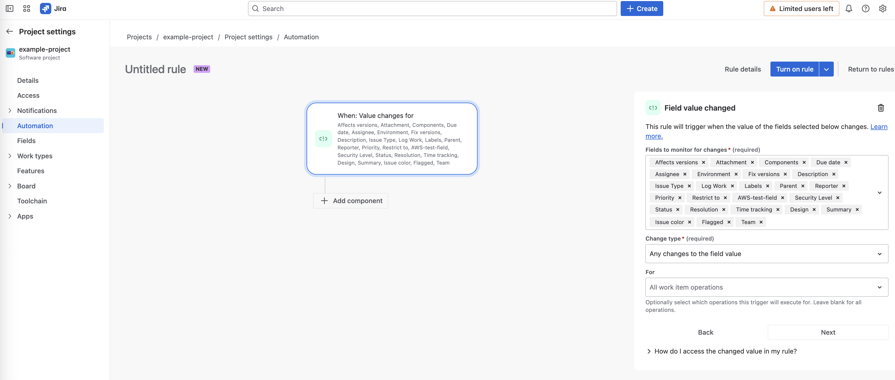
   4. Select `Change type` as `Any changes to the field value` *(default)*
   5. Select `For` as `All work item operations` *(default)*
   6. Click on `Next`
   7. For `New component`, select `THEN: Add an action` from `Add a component` pane on the right hand side.
   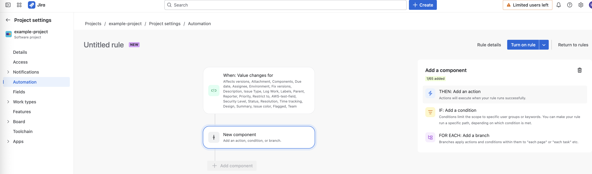
   8. Now, in `Add an action` pane on the right, select `Send message to Amazon SNS topic` option
   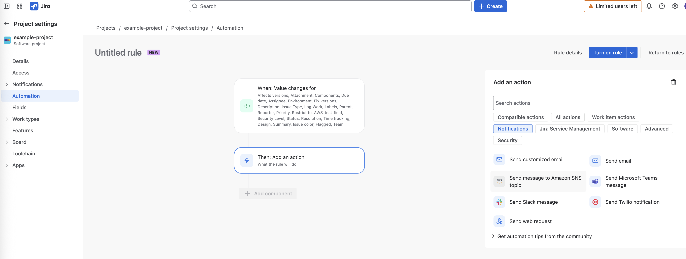
   9. Before we proceed to the next step, retrieve the AWS SNS topic arn from the JIRA integration stack that got deployed in your AWS account: CloudFormation > AwsSecurityIncidentResponseJiraIntegrationStack > Resources tab > Expand JiraNotificationsTopic resource > Copy the `Physical Id` which is the arn for the `JiraNotificationsTopic` 
   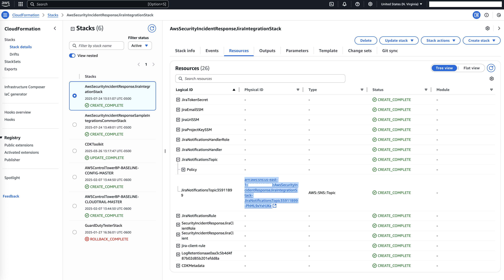
   10. Going back to the JIRA Automation page, in the `Send message to Amazon SNS topic` pane on the right, click on the `Connect` button under Connect Amazon SNS to Atlassian Automation. This should open up a pop-up - `Connect to Amazon SNS`. Within this pop-up, enter the SNS topic arn copied in the previous step.
   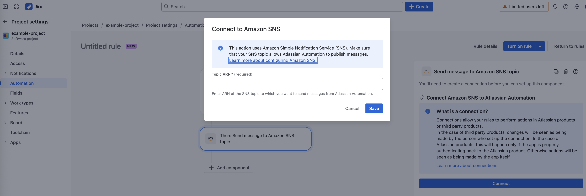
   11. After adding the connection, in the Key-value pairs under the `Send message to Amazon SNS topic` pane on the right:
       1. Enter `IssueId` as the key
       2. For datatype, select `String` from the dropdown
       3. Enter `{{issue.key}}` as the value
   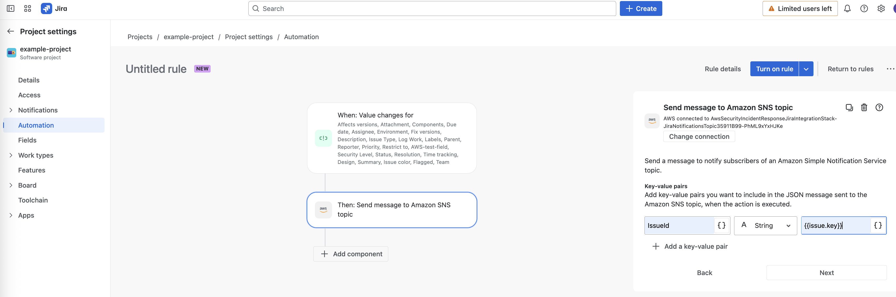
   12. (Optionally) Click on the down arrow next to `Turn on rule` button, and select `Validate rule` to test the rule connection. If the validation is successful, you should see a message `Your rule is ready to turn on. Keep an eye on the audit log for any further errors.`
   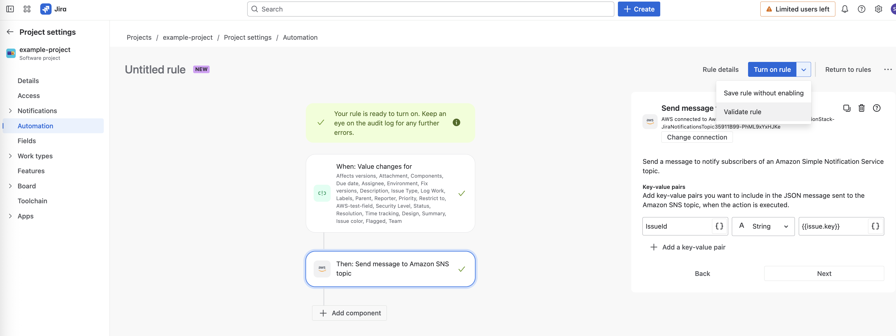
   13. Click on `Turn on rule`

#### Configure Automation Rule for Work Item Commented trigger (Required)

Follow the steps below to create a rule to trigger events to AWS when an operation is performed on issue comments, using the AWS SNS topic arn:

   1. Same as the previous section, in the `Automation` page, click on `Create Rule` > `Create from scratch` button.
   2. For `When: Add a trigger`, select `Work item commented` from `Add a trigger` pane on the right hand side.
   
   3. Now, in `Work item commented` pane on the right, select all the fields from the dropdown `Comment Type` i.e. `Comment is the main action`, `Comment added during status transition`, `Comment added while editing work item fields`
   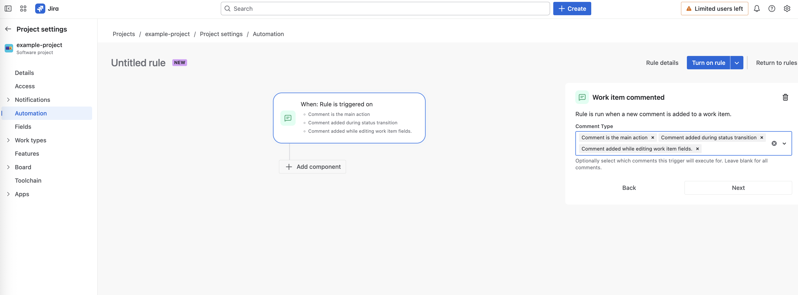
   4. Click on `Next`
   5. For `New component`, select `THEN: Add an action` from `Add a component` pane on the right hand side.
   6. Now, follow the steps 8 to 13 from the previous section.

### Perform a basic test (Optional)

Create a test Case in AWS Security Incident Response and verify it appears in Jira.

## Troubleshooting and Validation

For detailed information on outputs, validation, troubleshooting, and security considerations, please refer to the [Jira Troubleshooting Guide](JIRA_TROUBLESHOOTING.md).

## Architecture

The Jira integration for AWS Security Incident Response enables bidirectional communication between AWS Security Incident Response and Jira. This allows security incidents to be synchronized between both systems in real-time.

### Integration Overview

```
┌─────────────────┐                  ┌────────────────┐                  ┌─────────────┐
│                 │                  │                │                  │             │
│  AWS Security   │◄─── Updates ────►│   EventBridge  │◄─── Updates ────►│  Jira       │
│  Incident       │                  │   Event Bus    │                  │  Instance   │
│  Response       │                  │                │                  │             │
│                 │                  │                │                  │             │
└─────────────────┘                  └────────────────┘                  └─────────────┘
        ▲                                    ▲                                 ▲
        │                                    │                                 │
        │                                    │                                 │
        ▼                                    ▼                                 ▼
┌─────────────────┐                  ┌────────────────┐                  ┌─────────────┐
│                 │                  │                │                  │             │
│  Security IR    │                  │  Jira          │                  │  Jira SNS   │
│  Client Lambda  │                  │  Client Lambda │                  │  Topic      │
│                 │                  │                │                  │             │
│                 │                  │                │                  │             │
└─────────────────┘                  └────────────────┘                  └─────────────┘
```

### Integration Flow

There are two bidirectional flows in the integration between Jira and AWS Security Incident Response (SIR).

#### Flow 1: AWS Security Incident Response to Jira

1. The **Security IR Poller Lambda** periodically polls for incidents generated by SIR
2. It stores the incident details in DynamoDB and publishes Create, Update, or Delete events to EventBridge
3. The **Jira Client Lambda** subscribes to these EventBridge events
4. It gets or compares the incident details, updates the Jira issue ID, and performs the appropriate action in Jira (Create, Update, or Delete Jira issues)

#### Flow 2: Jira to AWS Security Incident Response

1. Jira publishes Create, Update, or Delete events of issues to the **Jira SNS Topic** via Jira Automation
2. The **Jira Notification Handler Lambda** subscribes to the SNS Topic and processes these events
3. It publishes the events to EventBridge
4. The **Security IR Client Lambda** subscribes to the Jira issue events and performs the appropriate operation (Create, Update, or Delete) on SIR

## Resources

### AWS Resources

The Jira integration stack creates the following AWS resources:

#### Lambda Functions

1. **Jira Client Lambda** (`SecurityIncidentResponseJiraClient`)
   - Processes events from AWS Security Incident Response
   - Creates or updates issues in Jira
   - Timeout: 15 minutes

2. **Jira Notifications Handler Lambda** (`JiraNotificationsHandler`)
   - Processes events from Jira via SNS
   - Publishes events to EventBridge

#### SNS Topic

- **Jira Notifications Topic** (`JiraNotificationsTopic`)
  - Receives events from Jira
  - Triggers the Jira Notifications Handler Lambda
  - Configured with appropriate permissions for Jira's AWS account

#### EventBridge Rules

1. **Jira Client Rule** (`jira-client-rule`)
   - Captures events from AWS Security Incident Response
   - Triggers the Jira Client Lambda

2. **Jira Notifications Rule** (`JiraNotificationsRule`)
   - Captures events from Jira
   - Logs events to CloudWatch

#### SSM Parameters

- `/SecurityIncidentResponse/jiraEmail`
- `/SecurityIncidentResponse/jiraUrl`
- `/SecurityIncidentResponse/jiraProjectKey`
- Jira token parameter (auto-generated name)

#### IAM Roles

- Custom roles for each Lambda function with least privilege permissions

#### DynamoDB Table

- Uses a shared table from the common stack to store issue mapping information

### Jira Resources

To use this integration, you'll need to configure the following in your Jira instance:

1. **Jira Automation Rule**:
   - Create automation rules in Jira to send events to the SNS topic when issues are created, updated, or deleted
   - Configure the AWS SNS trigger in Jira automation

2. **Jira Project**:
   - A project where security incident issues will be created
   - The project key is required for deployment

3. **Jira Issue Type**:
   - The integration creates issues with the "Task" issue type by default
   - This is configured as a constant in the integration code

## Frequently Asked Questions

### General Questions

**Q: How long does it take for changes to sync between systems?**  
A: Changes typically sync within seconds. The integration uses event-driven architecture to ensure near real-time updates.

**Q: Can I customize which issues are synchronized?**  
A: Yes, you can modify the Jira automation rules to filter issues based on criteria like project, issue type, or labels.

**Q: What happens if the integration fails?**  
A: The integration includes error handling and dead-letter queues. Failed events are stored and can be reprocessed. CloudWatch alarms will notify you of failures.

**Q: Does this integration support custom fields?**  
A: The base integration supports standard Jira issue fields. For custom fields, you'll need to modify the Lambda functions.

**Q: Can I use this with Jira Server/Data Center?**  
A: This integration is designed for Jira Cloud. For Jira Server/Data Center, you'll need to modify the authentication mechanism and API endpoints.

### Technical Questions

**Q: What permissions are required in Jira?**  
A: The integration user needs permissions to create and update issues in the specified project.

**Q: How are credentials stored?**  
A: Jira credentials are stored in AWS Systems Manager Parameter Store with secure string parameters.

**Q: Can I deploy multiple integrations to different Jira instances?**  
A: Yes, you can deploy the stack multiple times with different parameters to connect to different Jira instances.

## Related Resources

- [AWS Security Incident Response Documentation](https://docs.aws.amazon.com/security-incident-response/)
- [Jira API Documentation](https://developer.atlassian.com/cloud/jira/platform/rest/v3/intro/)
- [Jira Automation Documentation](https://support.atlassian.com/jira-cloud-administration/docs/automate-your-jira-cloud-processes-and-workflows/)
- [AWS SNS Documentation](https://docs.aws.amazon.com/sns/)
- [Atlassian API Token Documentation](https://support.atlassian.com/atlassian-account/docs/manage-api-tokens-for-your-atlassian-account/)